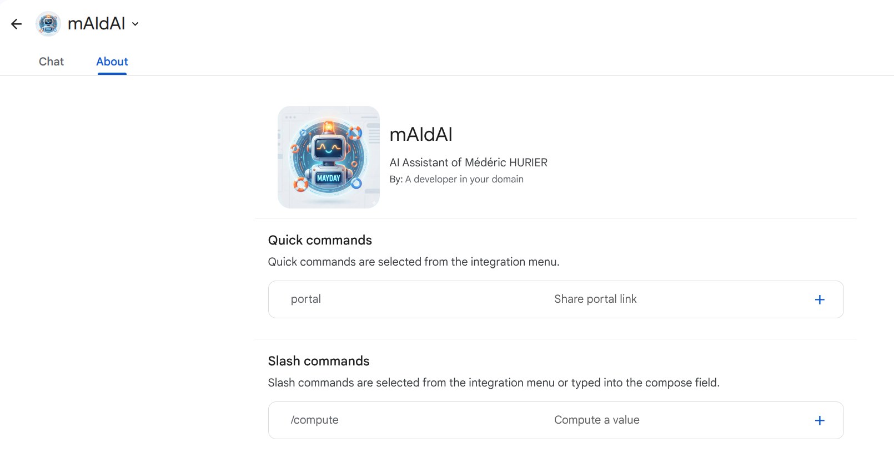
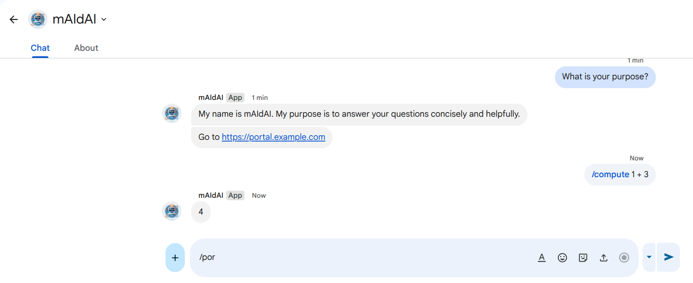
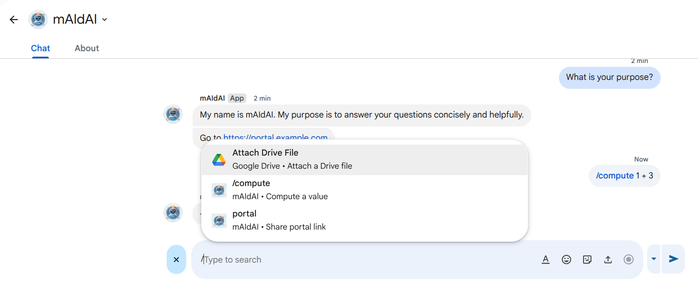

# mAIdAI: My AI Aid

**mAIdAI** is a personal open-source chatbot designed to be your smart assistant within Google Chat.

It leverages Google's Generative AI (Gemini via Vertex AI or Google AI Studio) to understand your specific context and automate responses.

| About | Message | Slash |
| :---: | :---: | :---: |
|  |  |  |

## Goal

The primary goal of mAIdAI is to provide a context-aware conversational agent that knows about your projects, preferences, and documentation. It can:

- **Automate common answers:** shortcuts to links, standard procedures, or FAQs using a simple command system.
- **Provide contextual assistance:** answer complex questions by relying on a custom "context" file (e.g., your personal docs, project specs).
- **Integrate deeply:** works directly within Google Chat as a bot.

## How It Works

mAIdAI is a Python application built with **FastAPI**. It functions as a webhook service for Google Chat.

1. **Context**: The bot is initialized with a `context.md` file (System Instructions), giving it a persona and knowledge base.
2. **Commands**: It checks incoming messages against a `commands.json` file for exact match shortcuts.
3. **GenAI**: If no command matches, it sends the user's prompt to a Google Gemini model to generate a helpful response based on the provided context.

## Repository Structure

- `main.py`: The core application logic (FastAPI app, GenAI client).
- `context.md`: The "memory" of the AI. Markdown file defining system instructions and knowledge.
- `commands.json`: Key-value pairs for instant, deterministic prompts and responses (shortcuts).
- `justfile`: Task runner for setup, testing, running, and deployment.
- `pyproject.toml`: Project configuration and dependency management (using `uv`).

## Prerequisites

Before you begin, ensure you have the following installed:

- **Python 3.13+**
- **[uv](https://github.com/astral-sh/uv)**: An extremely fast Python package installer and resolver.
- **[just](https://github.com/casey/just)**: A handy command runner.
- **[Google Cloud SDK](https://cloud.google.com/sdk/docs/install)**: Required for authentication and deployment to Google Cloud.

## Configuration

### 1. Environment Variables

Create a `.env` file in the root directory. You can use the following template:

```bash
# Google Cloud Configuration
GOOGLE_CLOUD_PROJECT="your-project-id"
GOOGLE_CLOUD_LOCATION="us-central1"
GOOGLE_GENAI_USE_VERTEXAI="true" # Set to false if using API Key / Google AI Studio

# Model Configuration
MODEL_NAME="gemini-2.0-flash"
LOGGING_LEVEL="INFO"
```

For authentication:

- If using **Vertex AI**, run `just auth` to authenticate locally with your Google credentials.
- If using **Google AI Studio (API Key)**, you might need to adapt the client initialization in `main.py` or set standard authentication environment variables.

### 2. Context & Commands

- **`context.md`**:  Write your specific context here. Tell the AI who it is, what it knows, and how it should behave.
- **`commands.json`**: Add key-value shortcuts.

  ```json
  {
      "1": "Here is the link to the documentation: https://...",
      "2": "I can help you with..."
  }
  ```

  *(See `commands.sample.json` for an example)*

## Usage

### Installation

Install python dependencies:

```bash
just install
```

### Code Quality

Run linting and formatting checks:

```bash
just check
```

## Deployment

The project is configured to deploy easily to **Google Cloud Run**.

1. **Prepare Production Config**: Create a `.env.prod.yaml` file for Cloud Run environment variables. Note that this must be a YAML file, unlike the local `.env`.

    ```yaml
    GOOGLE_CLOUD_PROJECT: "your-project-id"
    GOOGLE_CLOUD_LOCATION: "us-central1"
    GOOGLE_GENAI_USE_VERTEXAI: "true"
    MODEL_NAME: "gemini-2.0-flash-exp"
    LOGGING_LEVEL: "INFO"
    ```

2. **Authenticate**: Ensure you have authenticated with gcloud.

    ```bash
    just auth
    ```

3. **Deploy**:

    ```bash
    just deploy
    ```

This command will:

- Check code quality.
- Build and deploy the source code to Cloud Run.
- Configure the service with the necessary environment variables (ensure reference to `.env.prod.yaml` in `justfile` exists or is configured correctly).

## Google Chat Integration

Once your service is deployed and has a public URL (e.g., `https://maidai-xyz.a.run.app`):

1. Go to the **Google Cloud Console** > **API & Services** > **Enable APIs**.
2. Enable the **Google Chat API**.
3. Go to the **Google Chat API** configuration page.
4. Set up the **App URL** to point to your deployed Cloud Run endpoint.
5. In the **Connection settings**, select "HTTP Endpoint".
6. Configure permissions and visibility (who can call the bot).
7. Configure the commands (each number is associated with a shortcut).

### Cloud Run Authentication (Recommended)

If your Cloud Run service requires authentication, grant the Google Chat service account permission to invoke it.

```bash
gcloud run services add-iam-policy-binding [SERVICE_NAME] \
    --member="serviceAccount:[SERVICE_ACCOUNT_EMAIL]" \
    --role="roles/run.invoker" \
    --region [REGION] \
    --project [PROJECT_ID]
```

---

Now you can mention `@mAIdAI` in your Google Chat spaces or DM it directly!


